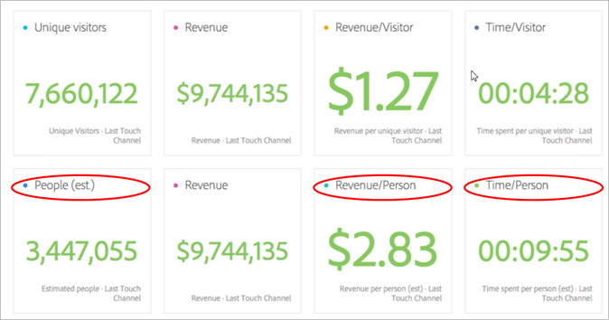
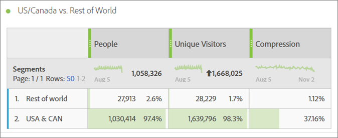
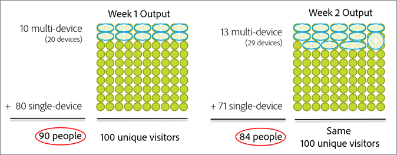
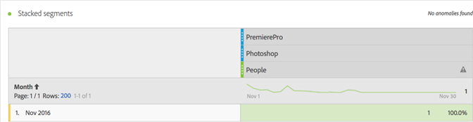
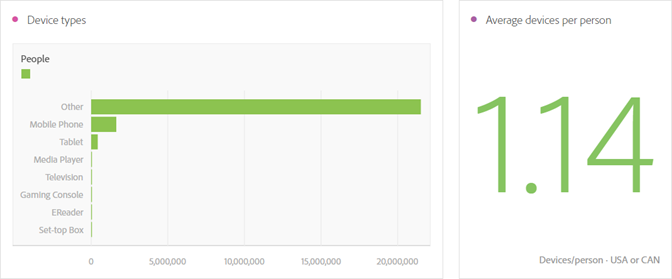
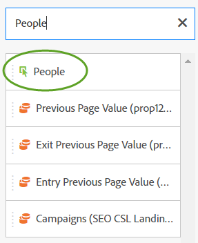

# Mensen metrisch{#people-metric}

Metrisch van Mensen is de telling van mensen (of groepen apparaten) die op de Grafiek van het Apparaat van Adobe wordt gebaseerd. U kunt metrisch van Mensen toepassen om bezoekers over hun apparaten in de Werkruimte van de Analyse te identificeren.

## Metrische vereisten en overwegingen van mensen {#section-34551d0435fb4b3cb3fad736b7961541}

<table id="table_120F7EF50042485391E58B22DD00A2A8"> 
 <thead> 
  <tr> 
   <th colname="col1" class="entry"> Vereisten of Overwegingen </th> 
   <th colname="col2" class="entry"> Beschrijving </th> 
  </tr>
 </thead>
 <tbody> 
  <tr> 
   <td colname="col1"> 
Apparaat-Co-op 
 </td> 
   <td colname="col2"> 
 Om metrisch van Mensen te gebruiken, word een lid van het Apparaat van het Apparaat van de Wolk van de <a href="http://landing.adobe.com/en/na/events/summit/275658-summit-co-op.html" format="html" scope="external"> Ervaring van Adobe Co-op</a>. Co-op identificeert de veelvoudige apparaten van een persoon (of de Cloud IDs van de Ervaring). Analytics maakt gebruik van deze informatie om statistisch het aantal mensen af te leiden dat interageert met een merk. Metrisch is nauwkeurig aan binnen 5%. 
 
<b>Regio</b>'s: De Device Co-op is momenteel alleen beschikbaar in de VS en Canada. Daarom wanneer het evalueren van de Metrische Mensen, zou u een segment op uw analyse moeten toepassen die uw gegevens voor de V.S. en Canada slechts filtert. 
 
Elke week berekent de Grafiek van het Apparaat een nieuwe versie van co-op en publiceert het voor gebruik. Op dinsdag verzamelt het systeem de meest recente gegevens en publiceert het een bijgewerkte versie van de grafiek. De oplossingen van de Wolk van de ervaring gebruiken dan de recentste versie van de grafiek. Specifiek voor Analytics, worden de veranderingen gelezen binnen op Woensdag en de verwerking van de veranderingen neemt typisch tussen 1 en 2 werkdagen in beslag. 
 
 
Belangrijk:  Wanneer de grafiek op een wekelijkse basis bijwerkt, kan het metrisch van Mensen historisch beïnvloeden. Met andere woorden, kan de historische tellingen van Mensen in tijd veranderen aangezien de grafiek leert en bijgewerkt is. Bijvoorbeeld, als u een rapport vandaag in werking stelt dat Mensen vorige maand telt, en dan het zelfde rapport in een week in werking stelt nadat de grafiek heeft bijgewerkt, kan de historische telling van Mensen lichtjes veranderen. 
 
 </td> 
  </tr> 
  <tr> 
   <td colname="col1"> Metrische vergunningen </td> 
   <td colname="col2"> 
U kunt metrisch van Mensen gebruiken slechts als u toegang tot het hebt gekregen. De beheerders kunnen<a href="https://marketing.adobe.com/resources/help/en_US/reference/groups-metrics.html" format="html" scope="external"> metrieke toestemmingen</a> in de Hulpmiddelen aanpassen Admin. 
 </td> 
  </tr> 
  <tr> 
   <td colname="col1"> Toewijzing aan IMS org </td> 
   <td colname="col2"> 
Metrisch van Mensen zal voor alle rapportreeksen worden toegelaten die aan een IMSORG <a href="https://marketing.adobe.com/resources/help/en_US/mcloud/map-report-suite.html" format="html" scope="external"> worden</a>in kaart gebracht. 
 </td> 
  </tr> 
  <tr> 
   <td colname="col1"> 
Projecten en hulpmiddelen voor analyse 
 </td> 
   <td colname="col2"> 
Gebruik metrisch Mensen in de Werkruimte  van deAnalyse,  Ad hoc Analyse, de Bouwer van het Rapport, en via API. U kunt het gebruiken waar u de Unieke metrische Bezoekers, met inbegrip van Berekende Metriek zou gebruiken. 
 
Bijvoorbeeld, creeer opbrengst-per-persoon metrisch om opbrengst-per-unieke bezoeker te vervangen metrisch. 
 
Een het projectmalplaatje <a href="https://marketing.adobe.com/resources/help/en_US/analytics/analysis-workspace/starter_projects.html" format="html" scope="external"> van</a> Mensen is beschikbaar begonnen te worden gebruikend de Metrische Mensen in de Werkruimte van de Analyse. 
 </td> 
  </tr> 
  <tr> 
   <td colname="col1"> 
Zet beide regels aan 
 </td> 
   <td colname="col2"> 
Adobe adviseert dat u <a href="https://marketing.adobe.com/resources/help/en_US/reference/bot_rules.html" format="html" scope="external"> Bodemregels</a>aanzet, vooral wanneer het gebruiken van de metrische Mensen. 
 
Wanneer een bot je website kruipt, verhoogt het kunstmatig je unieke bezoekersaantal. Het verwijderen van beide verkeer uit uw rapportreeks verstrekt een nauwkeurigere meting van activiteit op uw digitale eigenschappen, zowel in termen van Unieke Bezoekers als Mensen. 
 
Om dit te doen, navigeer aan  Analytics &gt;  Admin &gt; de Uitrustingen  van hetRapport. Selecteer de correcte rapportreeks, en ga dan om Montages  uit te geven &gt;  Algemeen &gt;  de Regelsvan het Bot. 
 </td> 
  </tr> 
  <tr> 
   <td colname="col1"> 
Segmenteringsoverwegingen 
 </td> 
   <td colname="col2"> 
 Wanneer u segmenten met metrisch van Mensen gebruikt, kan de metrische rapportering dramatisch lager zijn dan verwacht. 
 
Zie Metrisch Gebruiken van de Mensen met Segmenten . 
 </td> 
  </tr> 
 </tbody> 
</table>

## Wat is het metrisch van de mensen? {#section-89e2b8f5e80f480391449fc8d1117a6a}

Metrisch van Mensen is een Analyse rapporterend metrisch die u helpt apparaten aan mensen toeschrijven. Het verstrekt een op mensen-gebaseerde mening van marketing, latend u de activiteit van bezoekers over al hun apparaten meten. Denk aan het als een de-duplicatie versie van Unieke Bezoekers, en u kunt metrisch van Mensen voor analyse gebruiken waar u vroeger Unieke Bezoekers gebruikte.

**Apparaten zijn mensen**

Alvorens metrisch van Mensen beschikbaar werd, zou een persoon (bijvoorbeeld) uw plaats kunnen bezoeken en met een campagne of een merk op drie verschillende apparaten in dienst nemen en een aankoop maken, zelfs het doen binnen notulen. Afhankelijk van uw implementatie, zou de Analyse elk apparaat als unieke bezoeker kunnen melden en $10 aan drie apparaten in een aankoop van $30 toeschrijven.

Metrisch van Mensen laat u nauwkeurig dat $30 aankoop aan één persoon toeschrijven:

**Meer nauwkeurigheid in rapporten**

Metrisch van Mensen laat u toe om van veelvoudige apparaten als één enkele entiteit te denken. Het volgende project van de Werkruimte van de Analyse toont verhoogde nauwkeurigheidsvergelijkingen tussen de Unieke Bezoekers die en Mensen melden die melden:

Vergelijk mensen en unieke bezoekers naast elkaar:

**Definities**

<table id="table_F8171AF15DA64607B427E3739EF004D6"> 
 <thead> 
  <tr> 
   <th colname="col1" class="entry"> Object </th> 
   <th colname="col2" class="entry"> Beschrijving </th> 
  </tr>
 </thead>
 <tbody> 
  <tr> 
   <td colname="col1"> 
Mensen 
 </td> 
   <td colname="col2"> 
Metrisch van Mensen is gebaseerd op het idee dat de consumenten met uw merk gebruikend veelvoudige apparaten in wisselwerking staan. Hoe meer u uw gegevens segmenteert of segmenteert, hoe kleiner de kans dat dezelfde persoon meerdere apparaten heeft gebruikt binnen dat segment van gegevens. 
 </td> 
  </tr> 
  <tr> 
   <td colname="col1"> 
Unieke bezoekers 
 </td> 
   <td colname="col2"> 
Bijvoorbeeld, hoe meer u uw gegevens door datum of tijd snijdt, hoe kleiner het verschil tussen Mensen en Unieke bezoekers zal zijn. Als u een goed inzicht in het algemene effect van Co-op van het Apparaat wilt, adviseert Adobe gebruikend een datumwaaier van de laatste 90 dagen 
 </td> 
  </tr> 
  <tr> 
   <td colname="col1"> 
Compressie 
 </td> 
   <td colname="col2"> 
Gebruikend eenvoudige berekende metrisch kunt u zien hoeveel kleiner de Metrische Mensen als percentage van Unieke Bezoekers is. Klik op het info pictogram naast "Compression"in de lijst hierboven om te zien hoe te om dit metrisch tot stand te brengen. 
 
De mensen kunnen in andere berekende metriek in plaats van Unieke Bezoekers worden gebruikt. 
 </td> 
  </tr> 
 </tbody> 
</table>

## Hoe wordt het metrisch van de mensen berekend? {#section-0dfb762867e14a7f927796ef3c50592b}

<!--

Analytics uses the HyperLogLog statistical algorithm to calculate People. This means that the smaller the data set, the margin for error may increase. No more than 5% of the numbers should be off by more than 5% 

-->

Het volgende beeld toont aan hoe metrisch van Mensen wordt berekend en hoe het in tijd voor de zelfde waaier van de rapportdatum in het verleden kan verminderen.

In dit voorbeeld, veronderstel er een vaste reeks bezoekers is. Als u een rapport voor een vast tijdkader in het verleden in werking stelt, toont het een vaste reeks bezoekers. Als de output van de Grafiek van het Apparaat de gegevens op linker grafisch in week 1 worden getoond, die in 90 Mensen resulteert. Een week later, na de volgende looppas van de Grafiek van het Apparaat, wordt de nieuwe informatie in aanmerking genomen. Als je hetzelfde verslag runt als je een week geleden deed, is het aantal mensen gedaald naar 84. De geschiedenis is veranderd omdat de Grafiek van het Apparaat nieuwe informatie verstrekte over welke apparaten samen zouden moeten worden gegroepeerd.

## Het gebruiken van Metrisch Mensen met Segmenten {#section-d03525420dbe48379fd95b230ef05885}

Wanneer u segmenten met metrische Mensen gebruikt, kunnen de metrische resultaten dramatisch lager zijn dan verwacht. Deze kwestie komt voor omdat, in segmentatie, er geen *`person`* container is. De segmentatie gebruikt de container van de Bezoeker, die de container op het hoogste niveau in de definitie is en op het apparaat, niet op de persoon gebaseerd is.

Deze kwestie komt hoofdzakelijk voor wanneer het stapelen van segmenten met metrische Mensen.

Het stapelen van segmenten leidt tot een nieuw segment dat de combinatie van de segmenten vertegenwoordigt. Het stapelen van segmenten komt voor wanneer u:

* Plaats een segment bovenop een ander segment in de Werkruimte van de Analyse. (Deze worden automatisch aangesloten bij het gebruiken van de *`And`* exploitant.)
* Pas één enkel segment toe dat de *`And`* exploitant bevat.
* Pas een segment op zowel het projectniveau als lijstniveau toe.
* Gebruik een virtuele rapportreeks met een ander segment.

Bijvoorbeeld, veronderstel dat u de volgende segmenten op metrische Mensen stapelt:

* `Campaign = Spring Promotion`
* `Site Section = Product Overview`

Alleen het aantal personen dat in beide segmenten in aanmerking komt, wordt *`using a single device`* meegeteld. (Metrisch van Mensen toont niet het aantal kwalificerende mensen over apparaten.)

In deze situatie wordt het gebruik van de *`Or`* operator ook niet aanbevolen. Dat zou een telling opleveren van mensen die het een of het ander zagen, zonder dat er een manier was om te tellen hoeveel mensen in aanmerking komen voor beide segmenten.

Zie de Segmenten [van de](https://marketing.adobe.com/resources/help/en_US/analytics/segment/seg_build.html) Bouw in de hulp van de Segmentatie voor meer informatie.

## Apparaattypen {#section-8ab378c84ff34574b9c20fecb3848a86}

Het apparaat Co-op en metrische het werk van Mensen het best in de Analyse van Adobe wanneer uw rapportreeks gegevens van veelvoudige apparatentypes bevat. Bijvoorbeeld, maakt het combineren van Web en app gegevens in de zelfde rapportreeks metrisch van Mensen krachtiger en effectiever. De meer apparatenoversteekplaats in uw gegevens, groter de kans dat de veelvoudige unieke bezoekers samen als één enkele persoon zullen worden gegroepeerd.

## Ervaar de dekking van de Cloud ID-service {#section-bbf0098cac2e467289e7a644a1dea05c}

De Co-op van het Apparaat vereist dat uw digitale eigenschappen worden van instrumenten voorzien gebruikend de dienst van identiteitskaart van de Wolk van de Ervaring (MCID). Als de gegevens in uw rapportreeks een significant aantal bezoekers zonder MCID bevat, wordt de doeltreffendheid van Co-op van het Apparaat en metrisch van Mensen verminderd.

<!--
mcdc-people-metric-apply.xml
-->

In de Werkruimte van de Analyse, creeer een [project](https://marketing.adobe.com/resources/help/en_US/analytics/analysis-workspace/t_freeform_project.html)**[!UICONTROL People]** , dan sleep metrisch aan de projectlijst:

