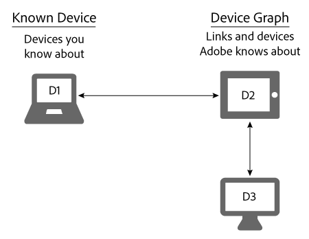

# Bekende apparaten{#known-devices}

Informatie over bekende apparaten in de grafiek van het Apparaat.

In de Grafiek van het Apparaat, hebben wij het concept *`known device`*. Een bekend apparaat is een apparaat dat een klant gebruikt om te communiceren met uw merk.

>[!NOTE]
>
>In de [!DNL Adobe Experience Cloud Device Co-op], termen zoals *`device`*, *`person`*, *`identity`* enz. specifieke betekenissen hebben. Bijvoorbeeld, &quot;apparaat&quot;kan naar fysieke hardware zoals een telefoon of een tablet en de toepassingen verwijzen die op die hardware lopen. Zie de [woordenlijst](../glossary.md#glossgroup-0f47d7fbd76c4759801f565f341a386c) voor definities.

## Ondersteunende doelstellingen met het bekende apparaat {#section-80deae33660e4280ac65c659ceff5601}

Het bekende apparatenconcept steunt een paar doelstellingen essentieel voor de verwezenlijking en het onderhoud van efficiënt [!DNL Device Co-op] programma. Een bekend apparaat is een apparaat dat [!DNL Device Co-op] lid is op de hoogte van enige interactie met een consument (bijvoorbeeld een bezoek aan een site of een mobiele app). Op basis van deze acties [!DNL Device Graph] Hiermee worden de bekende apparaten van een [!DNL Device Co-op] lid aan hulpmiddelen die door andere [!DNL Device Co-op] leden. Deze koppelingen kunnen [deterministisch of probabilistisch](../processes/links.md#concept-58bb7ab25f904f5f98d645e35205c931). Deze voordelen [!DNL Device Co-op] leden omdat zij ontvangen:

* Meer gegevens over hun bekende apparaten.
* Nieuwe informatie over andere, gekoppelde apparaten.

De [!DNL Device Graph] zal geen informatie over apparaat-clusters verstrekken die een Coop van het Apparaat lid niet heeft gezien.

## Coopdoelstellingen voor apparaten {#section-75aea5a102d54733aae2a7c6ee9ec6c7}

Drie hoofddoelstellingen animeren de [!DNL Device Co-op]. Deze omvatten:

* **Schalen:** Deel het maximum aantal mogelijke koppelingen in verschillende gebruiksgevallen.
* **Waardigheid:** Zorg ervoor dat elk lid van de [!DNL Device Co-op] uitkeringen op een wijze die in verhouding staat tot hun bijdragen.

* **Consumentenvertrouwen:** Handhaaf en vergroot het vertrouwen van de consument door ervoor te zorgen dat de ervaring van de consument op alle apparaten betrekking heeft op merken die hij al kent en vertrouwt.

## Schalen en het bekende apparaat {#section-67f734109762457ca62ec306284ea082}

De volgende methoden zijn de meer algemene manieren waarop een apparaat als een bekend apparaat wordt gekwalificeerd. Op basis van deze methoden [!DNL Device Co-op] de leden zullen bijna altijd minstens 1 gekend apparaat hebben. Dit steunt het doel van het verstrekken van maximumschaal aan alle leden van [!DNL Device Co-op].

**Organisch**

* Van het bezoek van een klant aan uw site of met uw app. Dit is kwalificatie van gegevens van de eerste partij.
* Door instapkaartklanten van een CRM-systeem.

**Marketplace**

* Segmentgegevens aanschaffen van Audience Marketplace.
* Gegevens van een externe gegevensaanbieder aanschaffen.

**Advertising**

Door een voorraad te winnen bij een veiling en een advertentie te sturen naar een apparaat. Het apparaat wordt een bekend apparaat als die advertentie een [!DNL Audience Manager] pixel.

## Bekende apparatuur en gevallen van billijk gebruik {#section-0543188729d845d6b95db70b8b25e9f8}

Leden van de [!DNL Device Co-op] krijgen verbindingen in verhouding tot hun bijdragen aan [!DNL Device Graph]. Bedrijven die veel apparaten aan de [!DNL Device Graph] meer links ontvangen dan leden die slechts een paar bijdragen . Wij zijn van mening dat dit de [!DNL Device Co-op] billijk voor alle leden. Laten we eens kijken hoe dit werkt met de hieronder beschreven gevallen van groot en klein gebruik.

**Merk A: hoofdletters**

In dit voorbeeld heeft Brand A elke maand 100 bezoekers van de site en wordt een nieuwe campagne voor verschillende apparaten gestart. Voor eenvoud, veronderstel [!DNL Device Graph] weet dat alle bezoekers van merk A zijn verbonden met 1 extra apparaat. Dit betekent dat merk A nog eens 100 apparaten kan bereiken. Daarnaast worden de [!DNL Device Graph] bevat ongeveer 200 apparaten die aan elkaar zijn gekoppeld.

<table id="table_78C38DC522F94BC38C1DB73740C058AC"> 
 <thead> 
  <tr> 
   <th colname="col1" class="entry"> Bekende apparaten/maand </th> 
   <th colname="col2" class="entry"> Gekoppelde apparaten die zijn ontvangen van Device Co-op </th> 
   <th colname="col3" class="entry"> Totaal aantal apparaten voor campagne </th> 
  </tr>
 </thead>
 <tbody> 
  <tr> 
   <td colname="col1"> 
100 
 </td> 
   <td colname="col2"> 
100 
 </td> 
   <td colname="col3"> 
200 
 </td> 
  </tr> 
 </tbody> 
</table>

**Merk B: Kleine letters voor gebruik**

In dit voorbeeld heeft Brand B elke maand 100 bezoekers van de site en wordt een nieuwe campagne voor verschillende apparaten gestart. Voor eenvoud, veronderstel [!DNL Device Graph] weet dat alle bezoekers van Brand B zijn gekoppeld aan 50 extra apparaten. Dit betekent dat merk B 150 apparaten kon bereiken. Daarnaast worden de [!DNL Device Graph] bevat ongeveer 1.000 apparaten die aan elkaar zijn gekoppeld.

<table id="table_A6C9CCF9C6564A89BA7060E075A8E73C"> 
 <thead> 
  <tr> 
   <th colname="col1" class="entry"> Bekende apparaten/maand </th> 
   <th colname="col2" class="entry"> Gekoppelde apparaten die zijn ontvangen van Device Co-op </th> 
   <th colname="col3" class="entry"> Totaal aantal apparaten voor campagne </th> 
  </tr>
 </thead>
 <tbody> 
  <tr> 
   <td colname="col1"> 
100 
 </td> 
   <td colname="col2"> 
50 
 </td> 
   <td colname="col3"> 
150 
 </td> 
  </tr> 
 </tbody> 
</table>

>[!MORELIKETHIS]
>
>* [Onbekende apparaten](../processes/unknown-device.md#concept-95090d341cdc4c22ba4319d79d8f6e40)

