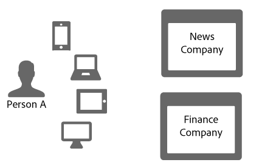
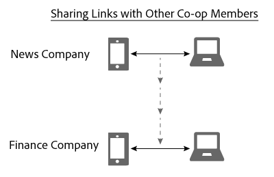

# Delen van koppelingen in de apparaatgrafiek{#link-sharing-in-the-device-graph}

Informatie over het delen van koppelingen in de apparaatgrafiek.

De [!DNL Device Graph] aandeeldeterministische en probabilistische banden met verschillende leden van de Coop van het Apparaat van Adobe Experience Cloud. Het delen van koppelingen is wat de [!DNL Device Co-op] kracht van de koppeling vergroot. Het breidt uit wat elk lid over de apparaten verbonden aan een anonieme persoon weet, maar slechts als u minstens één van de apparaten van die anonieme persoon eerder hebt gezien.

## Overzicht apparaatgrafiek {#section-7858e9f61b5644c981ffb53626fcc19d}

Voordat we aan de slag gaan, bekijken we hoe het [!DNL Device Graph] werkt. Leden van de [!DNL Device Co-op] groep sturen gegevens naar de [!DNL Device Graph]. De [!DNL Device Graph] gegevens gebruiken deze gegevens om de identiteit van een persoon te construeren vanuit [deterministische en probabilistische banden](../processes/links.md#concept-58bb7ab25f904f5f98d645e35205c931) tussen apparaten. Als [!DNL Device Co-op] deelnemer, verstrekken deze verbindingen inzicht over de verhouding tussen uw voor authentiek verklaarde gebruikers, andere gebruikers, en hun apparaten. Laten we eens kijken hoe dit werkt in de onderstaande sectie.

## Voorbeeld van delen van koppeling {#section-cb410d827cf14f76bc9b0bd4d31ed767}

In het volgende voorbeeld wordt de kracht van het delen van koppelingen getoond in de interface van het apparaat. In dit voorbeeld hebben we twee fictieve bedrijven, de News Company en de Finance Company. Beide ondernemingen zijn lid van de [!DNL Device Co-op]Commissie. Persoon A is een consument die of de websites van elk bedrijf van veelvoudige apparaten het programma opent of doorbladert.

Omdat Person A met hun mobiele telefoon en tablet voor authentiek verklaard aan de nieuwsplaats is, identificeert het Bedrijf van het Nieuws hen met een consument identiteitskaart Deze id wordt als cryptografische hash naar de [!DNL Device Graph] server verzonden. Het Bedrijf van Financiën heeft deze apparaten eerder gezien, maar Persoon A heeft niet aan de plaats het programma geopend. Bijgevolg weet de Finance Company niet of of of deze apparaten op elkaar betrekking hebben of hoe zij met Persoon A geassocieerd zijn.

Gezien de cryptografische hash van de consument-id [!DNL Device Graph] erkent de Commissie dat deze apparaten aan elkaar en aan een bepaalde persoon zijn gerelateerd. Aan bedrijven die niet deelnemen aan [!DNL Device Co-op] deze bezoeken lijken afzonderlijke, willekeurige apparatuur te komen. In elk geval, zodra het de hashed identiteitskaart [!DNL Device Graph] heeft het:

* Wist dat mobiele telefoon en laptop aan elkaar zijn gekoppeld.
* Erkent dat de Finance Company wil weten of de mobiele telefoon en laptop aan elkaar gekoppeld zijn.

Gezien deze voorwaarden, deelt het [!DNL Device Graph] nu de verbinding die deze apparaten voor het Bedrijf van het Nieuws met het Bedrijf van de Financiën verbindt. Tijdens dit proces, [!DNL Device Graph] dupliceert en deelt de verbinding van één cooplid aan een andere.

Op dit punt heeft de [!DNL Device Graph] opdrachtgever zijn rol succesvol vervuld. Zowel de News Company als de Finance Company hebben een duidelijk beeld van een identiteit. Zij kunnen Persoon A nauwkeurig over al hun apparaten bereiken.

## Privacy en delen van koppelingen {#section-7b566018b3304420a4b3e4c079826110}

Het behoud van de privacy van de consument en de integriteit van de gegevens voor de [!DNL Device Co-op] leden is van cruciaal belang tijdens het proces van het delen van koppelingen. Tijdens dit proces voor klantidentificatie en het delen van koppelingen [!DNL Device Graph] heeft de Commissie niet:

* Vertel de Finance Company dat de link van de News Company kwam.
* Deel de klant-id die door een [!DNL Device Co-op] lid wordt gebruikt met een ander lid.
* Geef andere informatie op dan dat het mobiele apparaat en de laptop een gemeenschappelijke koppeling delen.

## Volgende stappen {#section-ac6e61f1eb6e45b1bb4be8ece39147c7}

Het lezen van de documentatie over identiteit, het verbinden, en verbinding het delen zou u een goed idee van moeten geven hoe de [!DNL Device Graph] assemblee gegevens intern. Als volgende stap, adviseren wij een blik bij onze documentatie te nemen die beschrijft hoe het concept van een verbindingen over apparaten aan de leden van de Co-op van het Apparaat *`known device`* levert. Zie [Bekende Apparaten](../processes/known-device.md#concept-8e87c276819a48bfac5cef10b45216d1) en [Onbekende Apparaten](../processes/unknown-device.md#concept-95090d341cdc4c22ba4319d79d8f6e40).
