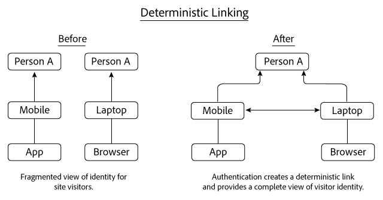
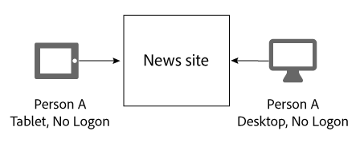
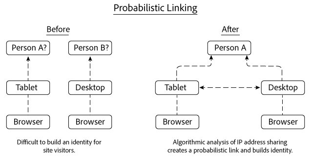
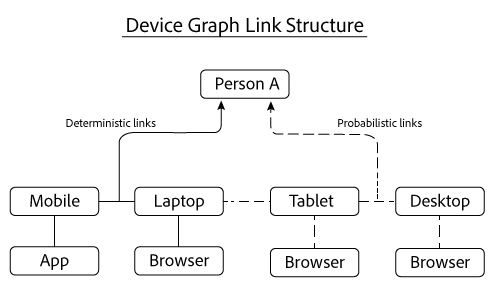

# deterministische en probabilistische banden{#deterministic-and-probabilistic-links}

Hoe de Grafiek van het Apparaat deterministische en probabilistische gegevens analyseert om een kaart te bouwen die apparaten samen verbindt.

In [!DNL Device Graph], bouwen de interne processen een identiteitshiërarchie die apparaten in kaart brengt en hen met individuele, geanonimiseerde mensen verbindt. De output van de grafiek omvat dwars-apparatenverbindingen u voor het richten samen met gegevens kunt gebruiken die in de uitgezochte oplossingen van de Wolk van de Ervaring worden blootgesteld. De oplossingen van Adobe die met [!DNL Device Graph] gegevens werken omvatten Analytics, de Manager van het Publiek, de Optimizer van Media, en Doel.

De [!DNL Device Graph] analyses deterministische en probabilistische gegevens om een kaart te bouwen die apparaten samen verbindt. De deterministische gegevens verbinden apparaten samen die op gehakte openings van een sessieinformatie worden gebaseerd. Probabilistische gegevens verbindt apparaten samen die op informatie zoals IP adressen en andere meta-gegevens worden gebaseerd. De [!DNL Device Graph] associaties de verbonden apparatenclusters aan een anoniem individu Deze verbindingen laten digitale marketers mensen in plaats van apparaten bereiken. In het [!DNL Device Graph], is de eigenaar van een apparaat de anonieme vertegenwoordiging van een real-life persoon. Zowel deterministische als probabilistische verbindingen helpen een structuur van gebruikersidentiteit bouwen.

>[!NOTE]
>
>In de Co-op van het Apparaat van het Apparaat van de Ervaring van Adobe, hebben de termijnen zoals *apparaat*, *persoon*, en de *identiteit* specifieke betekenissen. Bijvoorbeeld, kan het *apparaat* naar fysieke hardware zoals een telefoon of een tablet en de toepassingen verwijzen die op die hardware lopen. Zie de [verklarende woordenlijst](../glossary.md#glossgroup-0f47d7fbd76c4759801f565f341a386c) voor definities.

## Wat zijn links? {#section-2df4c6f01eba49369993146df0661f13}

Wanneer we het hebben over links, is het belangrijk om in gedachten te houden wat deze werkelijk zijn in de context van de Grafiek van het [!DNL Experience Cloud] Apparaat. In deze context, zijn de verbindingen geen fysieke verbindingen tussen apparaten. In plaats daarvan, is een verbinding hoe de Grafiek van het Apparaat verschillende apparaten aan de zelfde, onbekende persoon associeert. Bijvoorbeeld, zeg wij een mobiele telefoon en Desktopbrowser hebben. De telefoon en browser kunnen als &quot;verbonden&quot;worden beschouwd zodra de Grafiek van het Apparaat beide apparaten bepaalt door de zelfde, onbekende persoon worden gebruikt. Zoals u hieronder zult lezen, bouwt de Grafiek van het Apparaat identiteiten met deterministische en probabilistische verbindingen. In de Device Graph is de eigenaar van een apparaat de anonieme weergave van een echte persoon.

## Bepalende verbindingen {#section-33d41e828a674b398e36fe63da20ac09}

De deterministische verbindingen associëren een apparaat aan een persoon die op een authentificatiegebeurtenis wordt gebaseerd (b.v., een login actie aan een plaats van een apparaat). Deze actie leidt tot een anonymized herkenningsteken dat als consument - identiteitskaart wordt bekend Laten we eens kijken hoe deterministisch koppelen werkt. In dit voorbeeld, registreert de Persoon A aan een nieuwsplaats door een app op hun mobiel apparaat. Later die dag, registreert de Persoon A opnieuw, maar dit keer door browser op hun laptop.

Gebaseerd op de openings van een sessieinformatie, de Grafiek van het Apparaat:

* Weet dat de Persoon A aan de nieuwsplaats met een mobiele telefoon/app en laptop/browser apparatencombinatie voor authentiek verklaarde.
* Verbindt deze apparaten met Persoon A.
* Bouwt een identiteit die op verbonden apparaten wordt gebaseerd verbonden aan een anonieme persoon.

>[!NOTE]
>
>Noch de [!DNL Adobe Experience Cloud Device Co-op] of de [!DNL Device Graph] ontvangt werkelijke authenticatieinformatie of persoonlijk identificeerbare informatie (PII) in deze gegevens. De leden van [!DNL Experience Cloud Device Co-op], gaan in cryptografisch gehakte, unieke consument IDs tot de Grafiek van het Apparaat over. De consument-ID vertegenwoordigt een geverifieerde gebruiker in de grafiek en beschermt de privacy van de consument.

## Probabilistische links {#section-5f5aa755da984f9d851f7cb380262998}

Probabilistische verbindingen verbinden een apparaat aan een persoon algoritmisch, die op kenmerken en meta-gegevens zoals wordt gebaseerd:

* Browsergedrag
* IP-adressen
* Besturingssystemen
* IDFA- en GAID-identificatoren

Laten we eens kijken hoe probabilistische koppeling werkt. In dit voorbeeld, doorbladert de Persoon A aan een nieuwsplaats op hun tablet en dan later van een bureaucomputer. Terwijl het doorbladeren, registreert de Persoon A niet aan de nieuwsplaats. Tijdens elk afzonderlijk bezoek, delen de tablet en de Desktop het zelfde IP adres.

Gebaseerd op deze informatie, [!DNL Device Graph] evalueert IP adres delend patronen tussen beide apparaten en verbindt deze apparaten samen als de resultaten suggereren zij tot Persoon A behoren. Het eindresultaat is hiërarchie van identiteit die uit algoritmische kansberekeningen wordt afgeleid.

In dit voorbeeld, verbond de Grafiek van het Apparaat beide apparaten nadat zij werden gebruikt om tot de zelfde nieuwsplaats toegang te hebben. Maar de apparaten moeten niet op de zelfde plaats worden gezien om worden verbonden. Om dit punt te illustreren, zeggen elk apparaat in dit voorbeeld bezoeken volledig verschillende websites. Het [!DNL Device Graph] algoritme kan nog een probabilistische verbinding maken die op hun gedeeld IP adres en van een analyse van andere gegevens wordt gebaseerd. Dit proces is wat helpt probabilistische verbindingen zo krachtig voor leden van de Co-op van het [!DNL Experience Cloud] Apparaat maken.

## Beide soorten gegevens verstrekken waarde {#section-43d22d8c10634edcb261e7bda6fdf323}

De deterministische en probabilistische gegevens vullen elkaar aan. Door contrast, geeft een apparatengrafiek die slechts deterministische gegevens omvat u een beperkte mening van de identiteit van een persoon. Zonder authentificatie, kan een apparatengrafiek u niet over andere apparaten en mensen vertellen die uw plaats doorbladeren. Probabilistische gegevens kunnen deze verbindingen maken en u helpen bij het bereiken van niet-geverifieerde apparaten, mensen en huishoudens.

deterministische gegevens zijn echter ook belangrijk. Het kan bijvoorbeeld de probabilistische besluitvorming verbeteren door het wegnemen van valse verbindingen die ontstaan op plaatsen waar waarschijnlijke signalen overvloedig zijn en elkaar overlappen (bijvoorbeeld koffiewinkels, bibliotheken, luchthavens, enz.).

Met beide types van gegevens, geeft de Grafiek van het Apparaat u een uitvoeriger beeld van de identiteit van een persoon dan met één van beide type alleen.

